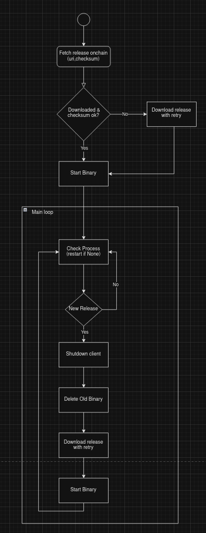

## Runner service

This service will constantly monitor for the on-chain storage information about the vault client. 
If a new client is detected, it will download and replace the client currently running.
It will also monitor for vault processes status, if no process is detected it will attempt to execute the one matching with latest download form on chain release info.

## Command to run vault

Runner arguments, we can pass as many client/vault commands as necessary after runner-specific commands.

```cargo run --bin runner -- --parachain-ws <chain-ws> --download-path <path_for_download_client> -- <vault_commands>...``` 

Example running a vault for local spacewalk standalone:

```cargo run --bin runner -- --parachain-ws ws://127.0.0.1:9944 -- --keyring alice  --stellar-vault-secret-key-filepath <secret_key_file_path> --stellar-overlay-config-filepath <cfg_file_path>```

## Runner service process diagram

